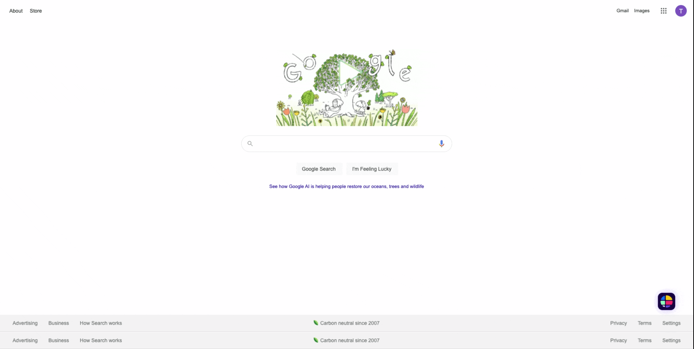

# [React StepZen Comets](https://react-stepzen-comets.herokuapp.com)
*By [Dale Sakamoto](https://github.com/DaleTsakamoto) and [David Griffin](https://github.com/davidleegriffin) and special thanks to [Sam Hill](https://github.com/SamuelGHill)*

## Overview
Using a Stepzen/Graphql backend to supply a react frontend using react hooks to store an object of known comets and likely impact points on planet earth. the frontend then queries the user for a location and an algorythm determines the closest location impact and the responsible comet. data pulled from NASA JPL API through Stepzen and into the waiting arms of our front end state.

## Project Setup

### Clone repository and install dependencies

```
git clone https://github.com/davidleegriffin/react-stepzen-comets.git
cd react-stepzen-comets && npm i
```

### Deploy API

The `stepzen start` command uploads and deploys your API automatically.

```bash
stepzen start
```
This also deployed our API to `https://username.stepzen.net/react-stepzen-comets/users/__graphql`. 


### Create `.env` file

```
touch .env
```
Fill in your username and set the URL to the `REACT_APP_STEPZEN_ENDPOINT` environment variable. Include your StepZen API key for the `REACT_APP_STEPZEN_API_KEY` environment variable.

```
REACT_APP_STEPZEN_API_KEY=YOUR_KEY_HERE
REACT_APP_STEPZEN_ENDPOINT=YOUR_ENDPOINT_HERE
```

Start the development server in a different terminal from the stepzen start but from the same root directory, it will serve on `localhost:3000`.

```
npm start
```

### [Example of Site Navigation]
A display of various routes taken while navigating site



### [Conclusion && Next Steps]:
Things learned while we worked on react-stepzen-comets:
```
coming soon
```


### [Technology Shields]:
        
